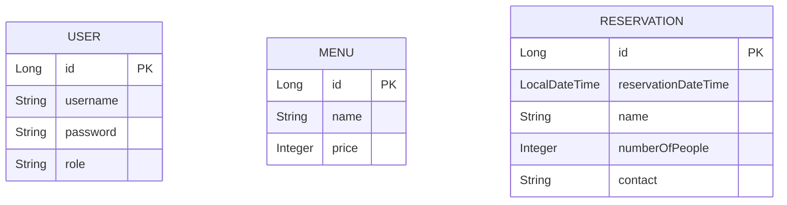

# レストラン予約システム - RestaurantSystem

Java + Spring Bootで構築した、飲食店向けの予約・メニュー管理システムです。

## 🌐 オンラインデモ

**Render でデプロイ済み**  
👉 https://restaurantsystem-n9d6.onrender.com/

### デモアカウント
- **ユーザー名**：`admin`
- **パスワード**：`adpass`

---

## 概要

このアプリケーションは、レストランの以下の機能を提供します：

- **メニュー管理**：管理者がメニュー項目（料理名、価格）を登録・編集・削除
- **予約管理**：一般ユーザーが予約を入力、管理者が予約一覧を確認
- **ユーザー管理**：管理者が店舗スタッフユーザーを作成・編集・削除
- **セキュリティ**：Spring Securityによるログイン認証・アクセス制限

---

## 設計ドキュメント

### ER図

以下は主要な３つのエンティティ間の構造を示したER図です。依存関係は特にありませんが、テーブル定義を整理するために図示しています。



### アーキテクチャ概要

本プロジェクトは典型的な Spring Boot の三層構造を採用しています。

1. **Controller** – HTTP リクエストを受け取り、サービスを呼び出します。
2. **Service** – ビジネスロジックを実装し、リポジトリを利用してデータ操作を行います。
3. **Repository** – Spring Data JPA による CRUD 操作を担当し、エンティティとデータベースをマッピングします。

各層は依存注入（`@Autowired`/`@Service`/`@Repository`）を通じて疎結合に保たれており、単体テスト時にはモックに差し替え可能です。

### 技術選択とこだわり

- **Spring Boot**：設定より規約で簡潔に構築でき、マイクロサービスへの拡張も容易なため採用。
- **Spring Security**：認証／認可の実装を自前で行うのはリスクが高く、フレームワーク標準でロールベースのアクセス制御ができるので選択。`CustomUserDetailsService`でデータベースからユーザーを読み込み、`SecurityConfig`でエンドポイントごとの制限を設定。
- **Thymeleaf**：サーバーサイドテンプレートで画面が簡単に作成でき、Java の変数埋め込みやセッション情報へのアクセスが容易。SPA 等の重たいフロントエンドは必要なかったため。
- **H2 Database**：開発時にセットアップ不要なインメモリ／ファイルベースDBで軽量。将来的に PostgreSQL 等に差し替え可能。
- **Lombok**：`@Data` や `@NoArgsConstructor` などでエンティティ／DTOのボイラープレートを削減し可読性を向上。
- **Docker/Render**：コンテナ化により環境差異を排除し、Render の無料プランで簡単にデプロイできる点を優先。`render.yaml` によりビルド〜実行コマンドと環境変数、永続ディスク設定を定義。

---

---

## システム要件

- **Java**：JDK 17.x（Amazon Corretto推奨）
- **Maven**：3.6以上
- **OS**：Windows / macOS / Linux

---

## セットアップ手順

### 1. リポジトリのクローン

```bash
git clone https://github.com/CHINAMI06/RestaurantSystem.git
cd RestaurantSystem
```

### 2. 依存関係のインストール

```bash
./mvnw clean install
```

（Windows PowerShellの場合）
```powershell
.\mvnw.cmd clean install
```

---

## 実行方法

### ローカル開発環境での起動

```bash
./mvnw spring-boot:run
```

（Windows PowerShellの場合）
```powershell
.\mvnw.cmd spring-boot:run
```

### ブラウザでアクセス

- **トップページ**：http://localhost:8080/
- **ログイン画面**：http://localhost:8080/login
- **H2 Console**：http://localhost:8080/h2-console

---

## 初期ユーザー情報

アプリケーション起動時に、初期管理者ユーザーが自動作成されます。

| ユーザー名 | パスワード | ロール |
|-----------|-----------|--------|
| `admin`   | `adpass`  | ROLE_ADMIN |

### H2 Console へのアクセス（開発環境のみ）

1. ブラウザで http://localhost:8080/h2-console にアクセス
2. 以下の情報を入力：
   - **JDBC URL**：`jdbc:h2:file:./data/restaurant_db`
   - **User Name**：`sa`
   - **Password**：（空白）
3. 「Connect」をクリック

---

## 機能説明

### 一般ユーザー（ログインなし）

| ページ | URL | 説明 |
|--------|-----|------|
| トップページ | `/` | メニュー、予約へのリンク表示 |
| メニュー一覧 | `/menu` | 登録されているメニューを表示 |
| 予約フォーム | `/reservation` | 予約日時、名前、人数、連絡先を入力 |
| 予約完了画面 | `/reservation/success` | 予約完了メッセージ表示 |

### 管理者（ログイン必須：`admin` / `adpass`）

| ページ | URL | 説明 |
|--------|-----|------|
| ダッシュボード | `/admin/index` | メニュー、予約、ユーザー管理へのリンク |
| メニュー一覧 | `/admin/menu` | メニューの一覧表示・追加 |
| メニュー追加フォーム | `/admin/menu/add` | 料理名と価格を入力して登録 |
| 予約一覧 | `/admin/reservation` | 顧客から受け付けた予約を確認 |
| ユーザー一覧 | `/admin/users` | 店舗スタッフユーザーの一覧表示 |
| ユーザー追加フォーム | `/admin/users/add` | 新規ユーザー（スタッフ）を作成 |
| ユーザー編集フォーム | `/admin/users/edit/{id}` | ユーザー情報を編集 |

---

## フォルダ構造

```
RestaurantSystem/
├── src/
│   ├── main/
│   │   ├── java/com/Restaurant/RestaurantSystem/
│   │   │   ├── config/
│   │   │   │   └── SecurityConfig.java           # セキュリティ設定
│   │   │   ├── controller/
│   │   │   │   ├── AdminMenuController.java      # メニュー管理（管理者）
│   │   │   │   ├── AdminReservationController.java # 予約一覧（管理者）
│   │   │   │   ├── AdminUserController.java      # ユーザー管理（管理者）
│   │   │   │   ├── PublicMenuController.java     # メニュー表示（公開）
│   │   │   │   └── PublicReservationController.java # 予約入力（公開）
│   │   │   ├── entity/
│   │   │   │   ├── Menu.java                     # メニューエンティティ
│   │   │   │   ├── Reservation.java              # 予約エンティティ
│   │   │   │   └── User.java                     # ユーザーエンティティ
│   │   │   ├── repository/
│   │   │   │   ├── MenuRepository.java
│   │   │   │   ├── ReservationRepository.java
│   │   │   │   └── UserRepository.java
│   │   │   ├── service/
│   │   │   │   ├── MenuService.java
│   │   │   │   ├── ReservationService.java
│   │   │   │   ├── UserService.java
│   │   │   │   └── CustomUserDetailsService.java # Spring Security用
│   │   │   └── RestaurantSystemApplication.java  # ブートストラップクラス
│   │   └── resources/
│   │       ├── application.yaml                  # 開発環境設定
│   │       ├── application-prod.yaml             # 本番環境設定
│   │       ├── static/
│   │       │   ├── css/
│   │       │   │   └── style.css                 # 共通スタイルシート
│   │       │   ├── js/
│   │       │   └── images/
│   │       └── templates/
│   │           ├── hello.html                    # トップページ
│   │           ├── login.html                    # ログイン画面
│   │           ├── admin/
│   │           │   ├── index.html                # ダッシュボード
│   │           │   ├── menu-list.html
│   │           │   ├── menu-form.html
│   │           │   ├── reservation-list.html
│   │           │   ├── user-list.html
│   │           │   └── user-form.html
│   │           └── public/
│   │               ├── menu-list.html
│   │               ├── reservation-form.html
│   │               └── reservation-success.html
│   └── test/
│       └── java/...                              # ユニットテスト（今後拡張）
├── data/
│   └── restaurant_db.mv.db                       # H2 Databaseファイル
├── Dockerfile                                    # Docker コンテナイメージ定義
├── .dockerignore                                 # Docker ビルド時の除外ファイル
├── render.yaml                                   # Render デプロイ設定
├── pom.xml                                       # Maven 設定
├── mvnw / mvnw.cmd                              # Maven Wrapper
├── .gitignore                                    # Git 設定
├── README.md                                     # このファイル
└── DEPLOYMENT.md                                 # デプロイガイド
```

---

## 技術スタック

| 技術 | バージョン | 目的 |
|------|-----------|------|
| Spring Boot | 3.5.10 | Javaフレームワーク |
| Spring Web | - | RESTful API & MVC |
| Spring Security | - | 認証・認可 |
| Spring Data JPA | - | ORM（データベース操作） |
| Thymeleaf | - | サーバーサイドテンプレートエンジン |
| H2 Database | - | インメモリ＆ファイルベースDB |
| Lombok | - | ボイラープレートコード削減 |
| Validation | - | 入力値検証 |
| Java | 17 LTS | プログラミング言語 |
| Docker | - | コンテナ化 |

---

## デプロイ

### Render へのデプロイ

本リポジトリには `render.yaml` が含まれており、Render.com におけるサービス定義を記述しています。
以下の設定により、GitHub の `main` ブランチに push すると自動的にビルド＆再デプロイが行われます。

```yaml
services:
  - type: web
    name: restaurant-system
    env: docker
    plan: free
    repo: https://github.com/CHINAMI06/RestaurantSystem
    branch: main
    dockerfile: ./Dockerfile
    buildCommand: ""
    startCommand: "java -jar app.jar"
    envVars:
      - key: SPRING_PROFILES_ACTIVE
        value: prod
      - key: SPRING_JPA_HIBERNATE_DDL_AUTO
        value: update
      - key: SPRING_H2_CONSOLE_ENABLED
        value: false
      - key: JAVA_OPTS
        value: -Xmx512m -Xms256m
    healthCheckPath: /actuator/health
    autoDeploy: true
    disk:
      name: restaurant-data
      mountPath: /var/data
      sizeGB: 1
```

- **env=docker**：Dockerfile を利用したビルド
- **startCommand**：コンテナ起動時に JAR を実行
- **envVars**：Spring プロファイルや H2 コンソール無効化、JVM オプションを指定
- **autoDeploy**：GitHub push による自動デプロイを有効化
- **disk**：永続ストレージを `/var/data` にマウント（プランによっては利用不可）

詳細は [DEPLOYMENT.md](DEPLOYMENT.md) を参照してください。

**現在のデプロイ状態**
- ✅ 本番環境：Render にデプロイ済み
- 🌐 **URL**：https://restaurantsystem-n9d0.onrender.com/
- 💾 **データベース**：H2 ファイルベース DB（`/var/data/restaurant_db`）
- 🔄 **自動デプロイ**：GitHub への push で自動に Render にデプロイされます

### ローカルでの Docker ビルド・実行

```bash
# イメージをビルド
docker build -t restaurant-system:latest .

# コンテナを実行
docker run -p 8080:8080 -v data:/var/data restaurant-system:latest
```

---

## よくある質問（FAQ）

### Q1. アプリが起動しない

**A.** 以下を確認：
- Java 17がインストール済み：`java -version`
- Maven 3.6以上がインストール済み：`mvn -version`
- ポート8080が使用されていないか確認
- `mvnw clean compile`を実行してコンパイルエラーを確認

### Q2. ログインができない

**A.** 初期認証情報を確認：
- ユーザー名：`admin`
- パスワード：`adpass`
- 大文字小文字は区別されます

### Q3. H2 Console にアクセスできない

**A.** JDBC URLと設定を確認：
- 開発環境（ローカル）: `jdbc:h2:file:./data/restaurant_db`
- JDBC URL が正しいか確認
- 相対パスはプロジェクトルートからの相対位置です

### Q4. 本番環境でのセキュリティ設定

**A.** 本番環境では以下を推奨：
- デフォルトの管理者パスワード（`admin`/`adpass`）を変更
- HTTPS を有効化（Render は自動的に HTTPS 対応）
- データベースを PostgreSQL などの管理型 DB に変更
- Spring Security の追加設定（CSRF 保護、CORS 等）

### Q5. データの永続化について

**A.** 
- **開発環境**：`./data/restaurant_db` に H2 ファイルが保存される
- **本番環境（Render）**：Persistent Disk を使用して `/var/data/restaurant_db` に永続化
  - FREE プラン：ディスク機能は利用不可（将来のプラン変更時に自動適用）
  - 現状：Git push/再デプロイでデータがリセットされます
  - **将来対応**：プランをアップグレードすると、`render.yaml` の disk 設定が自動的に有効になります

**永続化が有効な場合**：
- コンテナ再起動後も保持
- Git push ＆ 再デプロイ後も保持

---

## メール送信構成

### 予約完了メール送信

アプリでは予約が成功したときに、入力されたメールアドレス宛てに
確認メールを送るための Python スクリプトを呼び出します。

- スクリプト: `scripts/send_reservation_email.py`
- コントローラ: `PublicReservationController` が予約保存後に
  非同期で起動します。
- SMTP 設定は環境変数で渡します。
  ```text
  SMTP_HOST    (例: smtp.gmail.com)
  SMTP_PORT    (例: 587)
  SMTP_USER    (Gmail のフルアドレスやアプリパスワード)
  SMTP_PASS    (Gmail のアプリパスワード)
  FROM_EMAIL   (送信元アドレス、例 no-reply@yourdomain.com)
  ```

#### Gmail を使う場合

Gmail の SMTP サーバを利用するには以下を行ってください。

1. Google アカウントの「セキュリティ」設定で2 段階認証を有効化。
2. [アプリパスワード](https://myaccount.google.com/apppasswords)を発行し、
   `SMTP_USER` に Gmail アドレス、`SMTP_PASS` にアプリパスワードを設定。
3. `SMTP_HOST=smtp.gmail.com`, `SMTP_PORT=587` を使用し、
   スクリプト（またはアプリ）起動前に環境変数をエクスポート。

PowerShell の例:
```powershell
$env:SMTP_HOST = 'smtp.gmail.com'
$env:SMTP_PORT = '587'
$env:SMTP_USER = 'your@gmail.com'
$env:SMTP_PASS = 'xxxxxxxxxxxx'
$env:FROM_EMAIL = 'no-reply@yourdomain.com'
python scripts/send_reservation_email.py --to guest@example.com --name "山田 太郎" --datetime "2026-02-28 19:00" --people 2
```

Gmail 以外のプロバイダでも同様にホストとポートを
適宜設定してください。

---

## ライセンス

このプロジェクトはポートフォリオ用途です。

---

## 連絡先 / サポート

問題が発生した場合、以下をご確認ください：
- コンソールログでエラーメッセージを確認
- `data/restaurant_db.mv.db`ファイルが存在するか確認
- `.gitignore`に登録されたファイルを誤削除していないか確認

---

## 更新履歴

- **v1.0.0（2026-02-22）**
  - 初版リリース
  - メニュー管理、予約管理、ユーザー管理機能実装
  - Spring Security統合、ログイン認証実装
  - Render へのデプロイ完了
